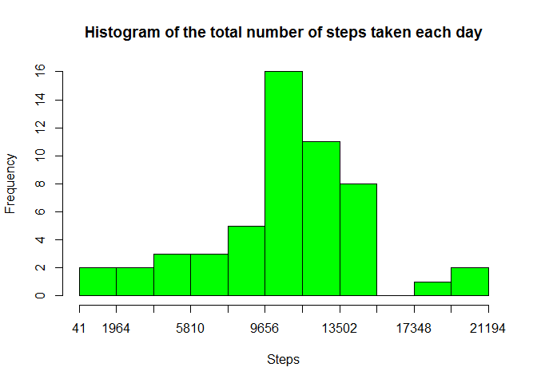
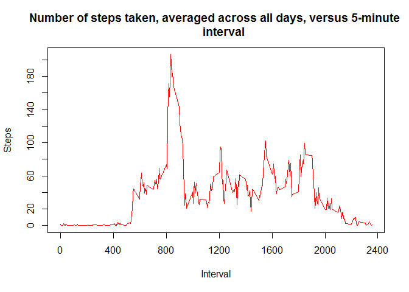
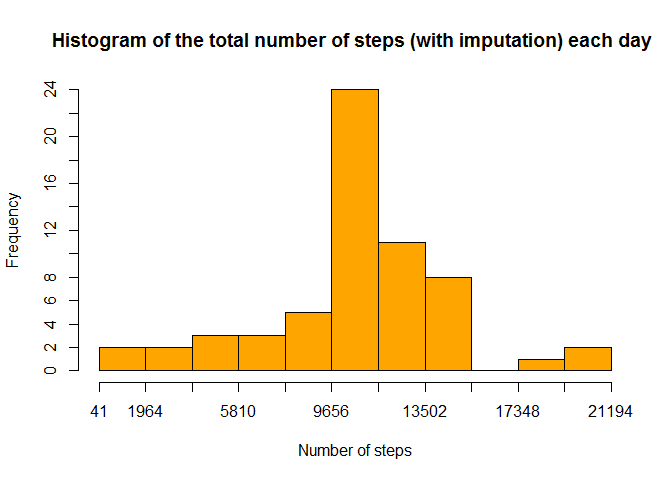
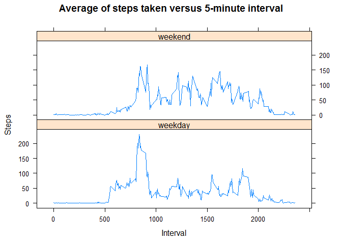

# Reproducible Research: Peer Assessment 1

## Loading and preprocessing the data
Load the data, and process/transform the data into a format suitable for my analysis.

- First I set global options, where I load the "knitr" package, set echo = TRUE to output results, and create a "figures" directory, within the working directory, to store the plots I create.

- I then unzip the data file, and read its contents into the "dat" data frame. Followed by creation of a "datC" data frame with only valid data (no NAs) from the "dat" data frame.

```r
require(knitr)
```

```
## Loading required package: knitr
```

```r
opts_chunk$set(echo = TRUE, fig.path = "figures/")
```


```r
unzip("repdata_data_activity.zip")
dat = read.csv("activity.csv", header = TRUE)
datC <- complete.cases(dat)
datC <- dat[datC, ]
```

## What is mean total number of steps taken per day?
I make a histogram of the total number of steps taken each day by summing the steps data in the "datC" data frame over each date in that data frame. This is assigned to 
the "sumStep" list. sumStep is then used as the basis of the data in the histogram.


```r
X <- tapply(datC$steps, datC$date, sum, na.rm = TRUE)
sumStep <- X[complete.cases(X)]

hist(sumStep, breaks = seq(min(sumStep), max(sumStep), length.out = 12), 
     col = "green", xaxt="n", yaxt = "n", 
     main = "Histogram of the total number of steps taken each day", 
     xlab = "Steps", ylab = "Frequency")
axis(side = 1, at=seq(min(sumStep), max(sumStep), length.out = 12), 
     labels = seq(min(sumStep), max(sumStep), length.out = 12))
axis(side = 2, at=seq(0, 16, length.out = 9), 
     labels = seq(0, 16, length.out = 9))
```

 

Then I calculate and report the mean and median total number of steps taken per day by taking the mean and median of the "sumStep" data.


```r
paste("The mean total number of steps taken per day is", mean(sumStep))
```

```
## [1] "The mean total number of steps taken per day is 10766.1886792453"
```

```r
paste("The median total number of steps taken per day is", median(sumStep))
```

```
## [1] "The median total number of steps taken per day is 10765"
```

## What is the average daily activity pattern?
- I make a time series plot of the 5-minute interval versus the average number of steps taken, averaged across all days by averaging the steps data in the "datC" data frame over each interval in that data frame. This is assigned to the "sumStep3" list.
- An "intervalUnique" list is created by using just the unique values of the "interval" vector in the "datc" dataframe. sumStep and intervalUnique are then used as the basis for the data in the plot.


```r
Y <- tapply(datC$steps, datC$interval, mean, na.rm = TRUE)
sumStep3 <- Y[complete.cases(Y)]
intervalUnique <- unique.default(sapply(datC$interval, unique))

plot(intervalUnique, sumStep3, type = "l", col = "red", xaxt = "n", 
     yaxt = "n", 
     main = "Number of steps taken, averaged across all days, versus 5-minute 
     interval", xlab = "Interval", ylab = "Steps")
axis(side = 1, at=seq(0, 2400, length.out = 7), 
     labels = seq(0, 2400, length.out = 7))
axis(side = 2, at=seq(0, 220, length.out = 12), 
     labels = seq(0, 220, length.out = 12))
```

 

I calculate Which 5-minute interval, on average across all the days in the dataset, contains the maximum number of steps by first calculating the maximum value of the sumStep3 list, and then determine the index number "indexMax" in that list, and then use indexMax to filter the intervalUnique vector to a single value intervalMax for the interval with the max number of steps.


```r
maxStep3 <- max(sumStep3)
indexMax <- which(sumStep3 %in% maxStep3)
intervalMax <- intervalUnique[indexMax]
paste("The 5-minute interval, which on average across all the days in the dataset, contains the maximum number of steps is", intervalMax)
```

```
## [1] "The 5-minute interval, which on average across all the days in the dataset, contains the maximum number of steps is 835"
```

## Imputing missing values
Then I calculate and report the total number of missing values in the dataset (i.e. the total number of rows with NAs) by summing the is.na() command when applied to the "dat" dataset.


```r
paste("The total number of missing values in the dataset is", sum(is.na(dat)))
```

```
## [1] "The total number of missing values in the dataset is 2304"
```

My strategy for filling in all of the missing values in the dataset is:

- To take the average across all days of the total number of steps taken in each 5 minute interval
- To apply that quantity to each corresponding 5 minute interval which is missing a value.

So, for example, if interval XYZ has some missing values, I obtain the mean value for the total number of steps for that interval XYZ, and use that to replace the missing steps values in that interval


I create a new "datK" dataset that is equal to the original dataset but with the missing data filled in, by obtaining data from the sumStep3 list of averages, and looping over all the intervals with missing data, and substituting the data from the sumStep3 list into the mising steps values.


```r
datK <- dat
liU <- length(intervalUnique)
ll <- length(datK[is.na(dat$steps), ][, 1]) / liU
for (i in 1:ll){
    for (j in 1:liU){
        k <- ((i-1) * liU) + j
        datK[is.na(dat$steps), ][k, 1] <- sumStep3[j]
    }
}
```

I make a histogram of the total number of steps taken each day using this new "datK" dataset and calculate and report the mean and median total number of steps taken per day. 


```r
Z <- tapply(datK$steps, datK$date, sum, na.rm = TRUE)
sumStepK <- Z[complete.cases(Z)]

hist(sumStepK, breaks = seq(min(sumStepK), max(sumStepK), length.out = 12), 
     col = "orange", xaxt="n", yaxt = "n", 
     main = "Histogram of the total number of steps (with imputation) each day ", 
     xlab = "Number of steps", ylab = "Frequency")
axis(side = 1, at=seq(min(sumStepK), max(sumStepK), length.out = 12), 
     labels = seq(min(sumStepK), max(sumStepK), length.out = 12))
axis(side = 2, at=seq(0, 24, length.out = 13), 
     labels = seq(0, 24, length.out = 13))
```

 

Do these values differ from the estimates from the first part of the assignment?

- Yes! The frequency of the mode appears to have increased, and the mean now equals the median (see below)

What is the impact of imputing missing data on the estimates of the total daily number of steps?

- The impact of imputing the missing data on the estimates of the total daily number of steps, using the method I have chosen, is to make the new mean value equal to the median value. The median value has not changed between the dataset with missing values, and the dataset with imputed values.


```r
paste("The mean total number of steps taken per day is", mean(sumStepK))
```

```
## [1] "The mean total number of steps taken per day is 10766.1886792453"
```

```r
paste("The median total number of steps taken per day is", median(sumStepK))
```

```
## [1] "The median total number of steps taken per day is 10766.1886792453"
```

## Are there differences in activity patterns between weekdays and weekends?

For this part the weekdays() function may be of some help here. Use the dataset with the filled-in missing values for this part.

I create a new factor variable in the dataset with two levels - "weekday" and "weekend" - indicating whether a given date is a weekday or weekend day.


```r
datK$day <- weekdays(as.Date(datK$date))
for (i in 1:length(datK$day)){
    if((datK$day[i] == "Saturday") | (datK$day[i] == "Sunday")){
		datK$dayType[i] <- "weekend"
	} else {
		datK$dayType[i] <- "weekday"
	}
}

datK$dayType <- factor(datK$dayType)
```

Make a panel plot containing a time series plot (i.e. type = "l") of the 5-minute interval (x-axis) and the average number of steps taken, averaged across all weekday days or weekend days (y-axis).

- I create two dataframes by subsetting the "datK" dataframes using the dayType values "weekday" and "weekend".
- I then average the steps data over the interval data in those two new dataframes.
- I only use the first 288 rows of each dataframe, as this is the number of unique intervals.
- I then row bind these two dataframes into a new data frame called "datKwDwE", call the "lattice" package, and then create a panel plot showing the mean of the number of steps over each interval, with weekend data in one panel, and weekday data in the other panel.


```r
datKwDay <- subset(datK, dayType == "weekday")
datKwEnd <- subset(datK, dayType == "weekend")

datKwDay$stepMean <- tapply(datKwDay$steps, datKwDay$interval, mean, 
                            na.rm = TRUE)
datKwEnd$stepMean <- tapply(datKwEnd$steps, datKwEnd$interval, mean, 
                            na.rm = TRUE)

datKwDay <- datKwDay[1:288, ]
datKwEnd <- datKwEnd[1:288, ]
datKwDwE <- rbind(datKwDay, datKwEnd)

library(lattice)
xyplot(stepMean ~ interval|dayType, datKwDwE, type = "l", layout = c(1, 2), 
       main = "Average of steps taken versus 5-minute interval", 
       xlab = "Interval", ylab = "Steps")
```

 

For reference, setup used is:

- OS: Windows 8.1 (64-bit)
- RStudio Version: 0.98.977
- R version: 3.1.1
- Processor: Intel Core i3-3217U @ 1.80GHz
